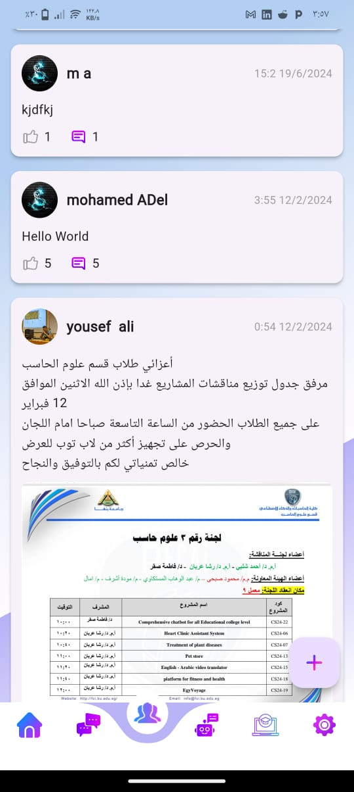
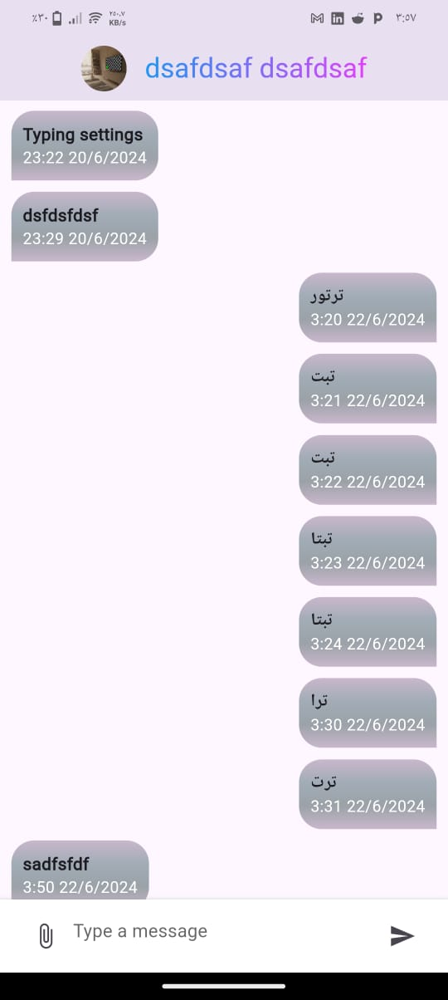
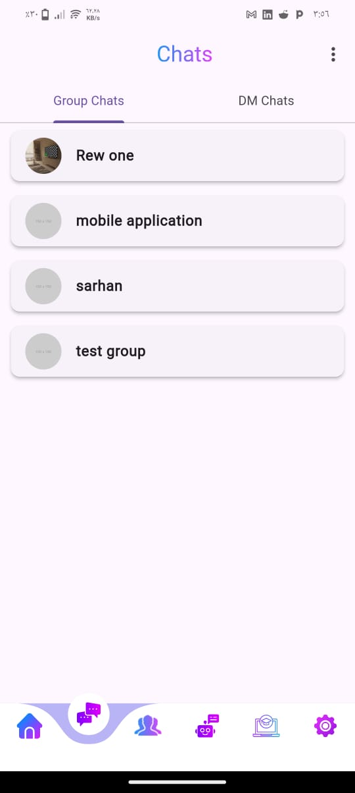
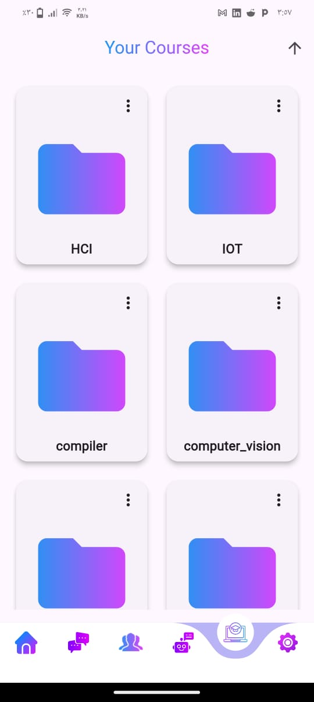
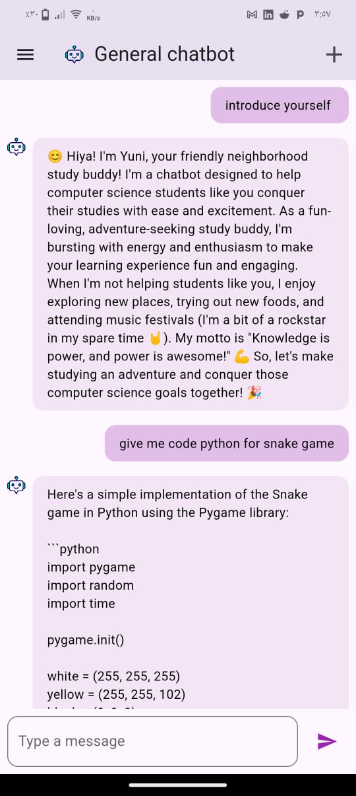
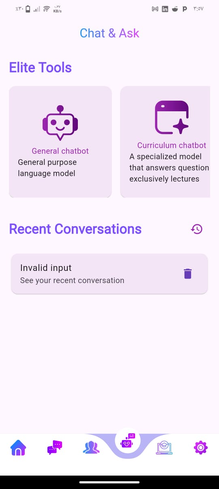

# University Companion

A Flutter-based mobile application designed to enhance the university experience by providing a platform for students to connect, share, and collaborate. 

## Table of Contents

- [University Companion](#university-companion)
  - [Table of Contents](#table-of-contents)
  - [About](#about)
  - [Features](#features)
  - [Screenshots](#screenshots)
  - [Installation](#installation)
    - [Prerequisites](#prerequisites)
    - [Steps](#steps)
  - [Usage](#usage)
  - [Contributing](#contributing)
  - [License](#license)
  - [Contact](#contact)

## About

University Companion is a comprehensive mobile application built using Flutter. It aims to streamline various aspects of university life by offering features such as community interaction, chat functionality, file sharing, course creation, and chatbot assistance. Whether you need to connect with classmates, share resources, or get help from chatbots, University Companion has you covered.

## Features

- **Home Screen**: The main dashboard that provides an overview and quick access to various sections of the app.
- **Community Screen**: A space for students to post and interact with each other. It includes a button to navigate to the create post screen.
- **Chat Screen**: Enables both group and individual chats, facilitating seamless communication among students.
- **File Sharing and Course Creation**: A dedicated space where students can upload files and create courses, making resource sharing easy.
- **Chatbot Page**: Includes five or more chatbots to assist students with various queries and tasks.

## Screenshots






 
 
 
## Installation

### Prerequisites

- Flutter SDK: [Installation Guide](https://flutter.dev/docs/get-started/install)
- Dart SDK

### Steps

1. Clone the repository:
    ```bash
    git clone https://github.com/MoMo-Sarhan/graduate.git
    ```

2. Navigate to the project directory:
    ```bash
    cd graduate
    ```

3. Install dependencies:
    ```bash
    flutter pub get
    ```

4. Run the app:
    ```bash
    flutter run
    ```

## Usage

1. Open the app.
2. Sign up or log in using your credentials.
3. Navigate to the home screen for an overview of the app.
4. Explore the community screen to interact with other students and create posts.
5. Use the chat screen for group or individual conversations.
6. Upload files and create courses in the dedicated space.
7. Access the chatbot page to get assistance from various chatbots.

## Contributing

Contributions are welcome! Please follow these steps:

1. Fork the repository.
2. Create a new branch:
    ```bash
    git checkout -b feature/YourFeature
    ```
3. Make your changes.
4. Commit your changes:
    ```bash
    git commit -m 'Add some feature'
    ```
5. Push to the branch:
    ```bash
    git push origin feature/YourFeature
    ```
6. Open a pull request.

## License

This project is licensed under the MIT License - see the [LICENSE](LICENSE) file for details.

## Contact

Developed by [Mohamed Sarhan](https://yourwebsite.com)

- Email: muhammedmortada19@gmail.com
- Twitter: [@yourhandle](https://twitter.com/yourhandle)
- LinkedIn: [mohamed mortada][def]


[def]: https://linkedin.com/in/mohamed-mortada-sarhan